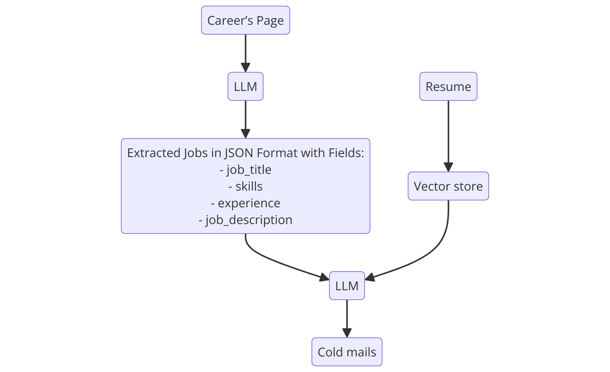

# 📧 Cold Mail Generator for Job Seekers

This tool generates personalized cold emails for job seekers. It allows users to input the URL of a job listing, and the tool will generate an email tailored to the job description. The user can also attach their resume, making it easier to reach out directly to hiring managers.

## **Imagine a Scenario:**

- You're a software engineer looking for a new opportunity.
- You come across a job listing on the careers page of a company like Google.
- Using this tool, you can generate a personalized email to the hiring manager with the job URL and your resume attached.


## Architecture Diagram


## Set-up

1. **API Key Setup**: To get started, you need to get an API_KEY from [Groq API](https://console.groq.com/keys). Inside `app/.env`, update the value of `GROQ_API_KEY` with the API_KEY you created.

2. **Email Credentials Setup**: To send cold emails using this tool, you need to configure your email credentials securely. Follow these steps:

    - Inside the `.env` file, add the following lines:
      ```bash
      EMAIL_ADDRESS=your-email@gmail.com
      EMAIL_PASSWORD=your-app-password
      ```
      
    - **How to get your App Password from Google:**
      1. Go to your [Google Account](https://myaccount.google.com/).
      2. Navigate to **Security**.
      3. Under **Signing in to Google**, enable **2-Step Verification** if you haven't done so already.
      4. Once 2-Step Verification is enabled, go to **App passwords**.
      5. Select the app and device you want to generate the app password for (choose "Mail" for the app and "Other" for the device).
      6. Copy the generated app password and use it as `EMAIL_PASSWORD` in your `.env` file.

3. **Install Dependencies**:
    ```bash
    pip install -r requirements.txt
    ```

4. **Run the Application**:
    ```bash
    streamlit run app/main.py
    ```

## License
This software is licensed under the MIT License. Commercial use of this software is strictly prohibited without prior written permission from the author. Attribution must be given in all copies or substantial portions of the software.
